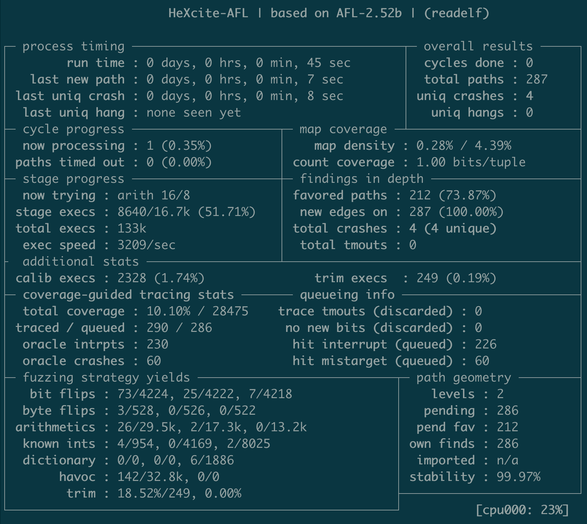

# HeXcite: High-Efficiency eXpanded Coverage for Improved Testing of Executables

This repository contains a prototype of **HeXcite**: our binary fuzzer accelerated by ***coverage-preserving* Coverage-guided Tracing**. HeXcite is built atop of the coverage-guided fuzzer [AFL 2.52b](https://lcamtuf.coredump.cx/afl/), and utilizes the [ZAFL binary rewriting project](https://git.zephyr-software.com/opensrc/zafl) for instrumentation and code transformation. HeXcite currently supports **64-bit non-PIE ELF** binary executables.
<table>
  <tr>
    <td align=center colspan="2"><div><b>Presented in our paper</b> <a href="https://dl.acm.org/doi/abs/10.1145/3460120.3484787"><i>Same Coverage, Less Bloat: Accelerating Binary-only Fuzzing with Coverage-preserving Coverage-guided Tracing</i></a><br>(2021 ACM SIGSAC Conference on Computer and Communications Security).</td>
  </tr>
  <tr>
    <td><b>Citing this repository:</b></td>
    <td>
      <code class="rich-diff-level-one">@inproceedings{nagy:samecovlessbloat, title = {Same Coverage, Less Bloat: Accelerating Binary-only Fuzzing with Coverage-preserving Coverage-guided Tracing}, author = {Stefan Nagy and Anh Nguyen-Tuong and Jason D. Hiser and Jack W. Davidson and Matthew Hicks}, booktitle = {{ACM} SIGSAC Conference on Computer and Communications Security (CCS)}, year = {2021},}</code>
    </td>
  </tr>
  <tr>
    <td><b>Developers:</b></td>
    <td>Stefan Nagy (<a href="mailto:snagy2@vt.edu">snagy2@vt.edu</a>) and Matthew Hicks (<a href="mailto:mdhicks2@vt.edu">mdhicks2@vt.edu</a>)</td>
  </tr>
  <tr>
    <td><b>License:</b></td>
    <td><a href="/FoRTE-Research/HeXcite/blob/master/LICENSE">MIT License</a></td>
  </tr>
  <tr>
    <td><b>Disclaimer:</b></td>
    <td><i>This software is provided as-is with no warranty.</i></td>
  </tr>
</table>

<p align="center">

</p>


## INSTALLATION
#### 1. Download and build ZAFL 
Please follow the build instructions for ZAFL available at the following link: https://git.zephyr-software.com/opensrc/zafl. 
**Make sure to set up ZAFL's environment variables accordingly.**

#### 2. Download and build HeXcite
```
git clone https://github.com/FoRTE-Research/HeXcite hexcite
cd hexcite
make clean && make all
```

## USAGE

#### 1. Configuring desired coverage mode
HeXcite relies on the ZAFL binary fuzzing rewriter to apply both coverage transformations (e.g., edge splitting, bucketed unrolling) and instrumentation (e.g., oracle forkserver, tracer instrumentation). Currently supported are three coverage configurations: **(1) UnTracer-style basic block coverage**, **(2) Jump Mistargeting-supported edge coverage**, and **(3) Bucketed Unrolling-supported loop hit count coverage**. Instructions for applying each configuration are below:

* **UnTracer-style basic block only coverage:**
```
zafl.sh [inputBinary] /tmp/oracle.zafl -t oracleDir -f
zafl.sh [inputBinary] /tmp/tracer.zafl -t tracerDir -u
```

* **Jump Mistargeting edge coverage:**
```
zafl.sh [inputBinary] /tmp/oracle.zafl -t oracleDir -f -c fallthroughs
zafl.sh [inputBinary] /tmp/tracer.zafl -t tracerDir -u -c all
```

* **Jump Mistargeting edge coverage + Bucketed Unrolling loop hit counts:**
```
zafl.sh [inputBinary] /tmp/oracle.zafl -t oracleDir -f -c fallthroughs -j
zafl.sh [inputBinary] /tmp/tracer.zafl -t tracerDir -u -c all -j
```

#### 2. Producing the oracle-to-tracer mapping
To understand where breakpoints must be inserted, HeXcite requires a mapping between the oracle and tracer binaries. To generate this, run `hexcite-mapper.py` on the ZAFL-generated oracle and tracer binary output dirs:
```
hexcite-mapper.py oracleDir tracerDir outMap mapLog
```
Mapping errors will be appended to `mapLog`. While a few mapping errors are normal for most binaries, seeing *many* indicates something is wrong on the ZAFL rewriting/analysis side. Please report to us any such occurrences! 

#### 3. Fuzzing with HeXcite
After applying the desired coverage configuration, run HeXcite as follows:
```
hexcite-afl -i [/path/to/seeds] -o [/path/to/outdir] [optional_args] \
	-O oracleDir/c.out -T tracerDir/c.out -B outMap \
	-- [/path/to/target] [target_args]
```
Note that the target supplied does not matter: the *real* target binary will be `c.out` from the ZAFL-generated `oracleDir`.


## STATUS SCREEN
* `calib execs` and `trim execs` - Number of testcase calibration and trimming executions, respectively. Tracing is done for both.
* `total coverage` - Coverage percentage found (left) over total (right). Unlike UnTracer, this number does *NOT* directly correspond to basic blocks, as HeXcite repurposes UnTracer-style interrupts to reveal finer-grained edge and hit count coverage.
* `traced / queued` - Ratio of traced versus queued testcases. This ratio should (ideally) be `(traced - total_crashes) : queued`, but will increase as tracing timeouts occur.
* `trace tmouts (discarded)` - Number of testcases which timed out during tracing. Like AFL, we do not queue these.
* `no new bits (discarded)` - Number of testcases which were marked coverage-increasing by the oracle but did not actually increase coverage. This should (ideally) be 0.
* `oracle intrpts` - Number of testcases that triggered UnTracer-style breakpoints (i.e., hit a new basic block or a higher Bucketed Unrolling loop count). This should (ideally) equal the value shown in `hit interrupt (queued)`. 
* `oracle crashes` - Number of testcases that triggered a Jump Mistargeted critical edge (i.e., hit the critical edge and crashed from being forced to the zero address). This should ideally equal the value shown in `hit mistarget (queued)`.

#
<p align=center> <a href="https://www.cs.vt.edu">
</a> </p>
